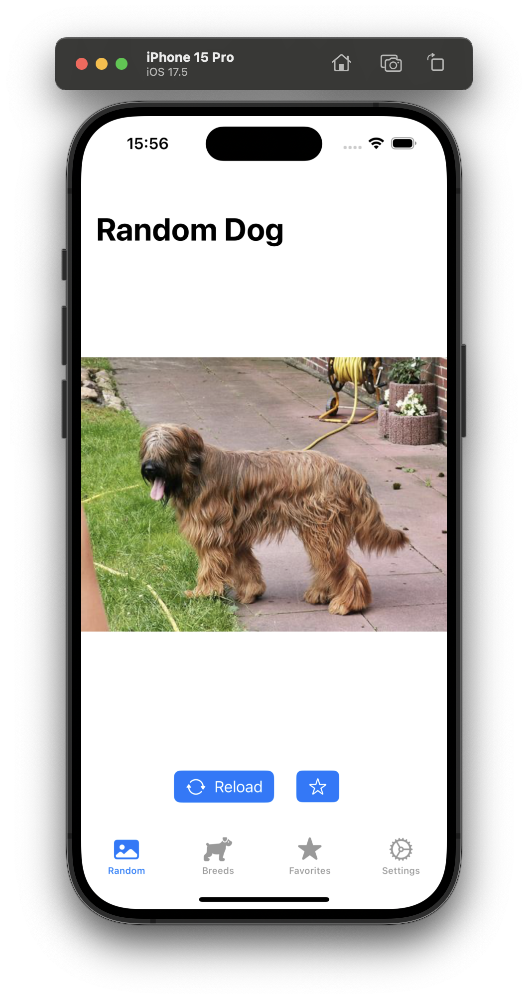

# DogBreed App

DogBreed App is a mobile application developed using Swift and SwiftUI that allows users to identify different breeds of dogs. This project implements the SwiftUI First design pattern as outlined in [this article](https://apurin.me/articles/swiftui-first/).



## Features

- **SwiftUI First Pattern**: The app is structured following the principles of the SwiftUI First design pattern, which emphasizes SwiftUI as the primary framework for building UI components.
- **Dog Breed Identification**: Users can fetch random images of different dog breeds, save those images, and learn about all dog breeds.
- **User-Friendly Interface**: The app features a clean and intuitive UI, making it easy for users to navigate and use.

## Project Structure Diagrams
### App Container
Everything revolves around the `App Container` where all the dependencies are initialized, including:

1. **Infrastructure Layer**: Such as the Realm framework and API layer.
2. **Services**: Built on top of the Infrastructure layer, including `BreedListService` and `FavoritesService`.
3. **UI Layer**: ScreenFlows responsible for ScreenData and Screen Navigation.
4. **Domain**: Core entities such as Breed or SubBreed and other helpers.

Another interesting point of this pattern is the use of the SwiftUI Environment to pass around global services like `BreedListService` as `AppActions` and `AppStates`, allowing any view to access them in a way that respects the nature of SwiftUI.

Finally, the Live App Container uses real data for the application, while the Mock App Container is configured for use in previews.


## Installation

To get started with the DogBreed App, follow these steps:

1. **Clone the repository**:
   ```sh
   git clone https://github.com/anthony1810/BreedApp_swiftUI_first.git
2. **Navigate to the project directory**:
   ```cd BreedApp_swiftUI_first```
3. **Open the project in Xcode**:
   ```open DogBreedApp.xcodeproj```
4. **Install dependencies**:
   ```swift package resolve```
5. **Build and run the app**:
Select your target device or simulator and click the "Run" button in Xcode.

## Usage
Identify Dog Breeds: Upload a picture of a dog to identify its breed.
Browse Breeds: Explore a list of different dog breeds and learn more about each one.

## Contributing

Contributions are welcome! If you'd like to contribute, please follow these steps:

1. Fork the repository.
2. Create a new branch:
```git checkout -b feature/your-feature-name```
3. Commit your changes:
```git commit -m 'Add some feature'```
4. Push to the branch:
```git push origin feature/your-feature-name```
5. Create a Pull Request.

## License
This project is licensed under the MIT License. See the LICENSE file for more details.

## Acknowledgements

Thanks to [Apurin.me](https://apurin.me) for the insightful article on the SwiftUI First design pattern.

## Contact
For any inquiries or feedback, feel free to reach out to [qquang269@gmail.com].

Happy coding!
