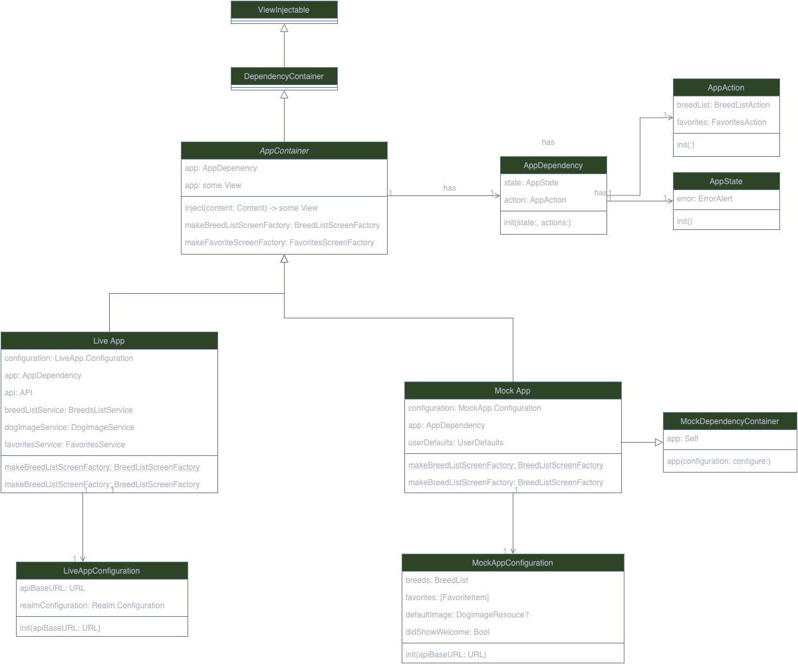

# Introduction
I have developed multiple SwiftUI apps, ranging from small to large, available on the App Store.
In all of them, I use MVVM-C, a pattern I have relied on to develop UIKit apps for most of my career. 
I can't complain; it works well with UIKit apps, whether using Combine or RxSwift.

However, I always felt something was missing, something unnatural. 
It seemed like I was bending SwiftUI to fit MVVM, which was often inconvenient.

Then I read [Stop Using MVVM for SwiftUI](https://forums.developer.apple.com/forums/thread/699003), and that’s when I discovered the [SwiftUI First pattern](https://apurin.me/articles/swiftui-first/). 
This project demonstrates the power of this pattern and marks my transition away from MVVM for SwiftUI.

# DogBreed App

DogBreed App is a mobile application developed using Swift and SwiftUI that allows users to identify different breeds of dogs. This project implements the SwiftUI First design pattern as outlined in [this article](https://apurin.me/articles/swiftui-first/).

## Features

- **SwiftUI First Pattern**: The app is structured following the principles of the SwiftUI First design pattern, which emphasizes SwiftUI as the primary framework for building UI components.
- **Dog Breed Identification**: Users can fetch random images of different dog breeds, save those images, and learn about all dog breeds.
- **User-Friendly Interface**: The app features a clean and intuitive UI, making it easy for users to navigate and use.

## Why SwiftUI First?

### Challenges with MVVM

- **Redundancy of ViewModel**: In SwiftUI, the View binds directly to the state, making a separate ViewModel layer somewhat redundant.
- **Logic Separation**: Most logic resides deeper within the Model layer (UseCases, Repositories, Services), reducing ViewModels to merely forwarding calls and connecting publishers to properties.
- **Data Preparation and Transformation**: SwiftUI handles data preparation and transformation within the View itself using features like FormatStyle and localized strings.
- **Dependency Handling**: Managing environment-dependent data in ViewModels is cumbersome, requiring dependency injection during or after initialization and updates.
- **View State Management**: Under strict MVVM, handling states like focus or fetching Core Data objects in ViewModel is challenging.
- **Performance Issues**: Modeling all state with @Published properties in a single ObservableObject reduces granularity in view updates, causing performance inefficiencies.
- **Restrictive Nature**: MVVM feels restrictive, forcing SwiftUI to conform to architectural dogmas rather than leveraging SwiftUI’s strengths.

### Benefits of SwiftUI First

A SwiftUI-first architecture fully embraces and utilizes the tools provided by SwiftUI:

- **State Management**: SwiftUI offers robust state management through property wrappers like @State, @StateObject, and @ObservedObject, and integrates seamlessly with UserDefaults, CoreData, and SwiftData using @AppStorage, @FetchedRequest, and @Query.
- **Dependency Resolution**: The Environment mechanism allows clean and organized dependency injection into views, preferred over custom dependency injection solutions or global objects.
- **Previews**: Previews act as a form of unit testing for UI code, enabling quick verification of views' appearance and behavior under different conditions. An architecture supporting easy implementation and maintenance of previews fosters faster and more reliable development.
- **Clarity**: SwiftUI’s declarative style keeps UI and behavior closely linked, making the app's workings straightforward by examining its views.
- **Flexibility**: SwiftUI’s evolution includes new features and capabilities, such as the App lifecycle, Widgets, App Intents, Concurrency, and Observability. An adaptable architecture allows easy incorporation of these new features.

While there isn’t a single correct way to create a SwiftUI-first architecture, scaling back from MVVM by removing ViewModels and gradually refining the project structure has proven effective.

## Project Structure Diagrams
### App Container
Everything revolves around the `App Container` where all the dependencies are initialized, including:

1. **Infrastructure Layer**: Such as the Realm framework and API layer.
2. **Services**: Built on top of the Infrastructure layer, including `BreedListService` and `FavoritesService`.
3. **UI Layer**: ScreenFlows responsible for ScreenData and Screen Navigation.
4. **Domain**: Core entities such as Breed or SubBreed and other helpers.

Another interesting point of this pattern is the use of the SwiftUI Environment to pass around global services like `BreedListService` as `AppActions` and `AppStates`, allowing any view to access them in a way that respects the nature of SwiftUI.

Finally, the Live App Container uses real data for the application, while the Mock App Container is configured for use in previews.



## Installation

To get started with the DogBreed App, follow these steps:

1. **Clone the repository**:
   ```sh
   git clone https://github.com/anthony1810/BreedApp_swiftUI_first.git
2. **Navigate to the project directory**:
   ```cd BreedApp_swiftUI_first```
3. **Open the project in Xcode**:
   ```open DogBreedApp.xcodeproj```
4. **Install dependencies**:
   ```swift package resolve```
5. **Build and run the app**:
Select your target device or simulator and click the "Run" button in Xcode.

## Usage
Identify Dog Breeds: Upload a picture of a dog to identify its breed.
Browse Breeds: Explore a list of different dog breeds and learn more about each one.

## Contributing

Contributions are welcome! If you'd like to contribute, please follow these steps:

1. Fork the repository.
2. Create a new branch:
```git checkout -b feature/your-feature-name```
3. Commit your changes:
```git commit -m 'Add some feature'```
4. Push to the branch:
```git push origin feature/your-feature-name```
5. Create a Pull Request.

## License
This project is licensed under the MIT License. See the LICENSE file for more details.

## Acknowledgements

Thanks to [Apurin.me](https://apurin.me) for the insightful article on the SwiftUI First design pattern.

## Contact
For any inquiries or feedback, feel free to reach out to [qquang269@gmail.com].

Happy coding!
